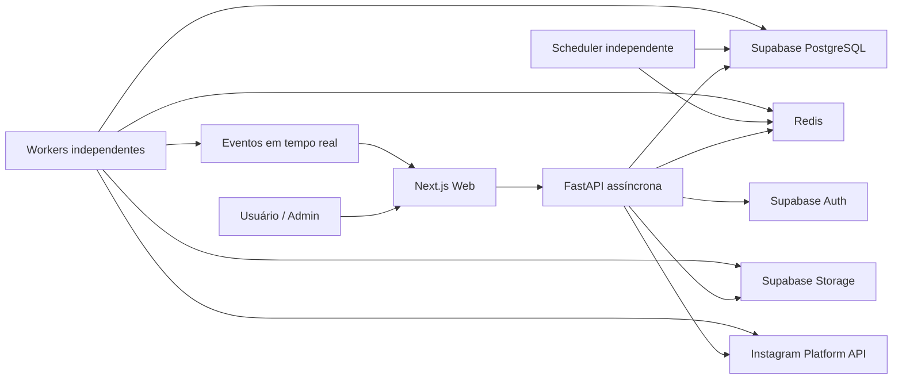

# Arquitetura do sistema

## 1. Estilo

Monólito modular no backend, com processos implantáveis separadamente:

- API;
- scheduler;
- workers;
- tarefas de manutenção.

Essa abordagem reduz complexidade inicial sem acoplar a execução de publicações ao ciclo HTTP. Módulos podem ser extraídos posteriormente se métricas justificarem.

## 2. Diagrama de contexto



## 3. Componentes

### Frontend

- UI e roteamento.
- Autenticação com Supabase Auth.
- Consumo da API PostX.
- Upload, preferencialmente direto ao Storage por URL assinada.
- WebSocket com reconexão e fallback para polling.
- Nenhuma regra de autorização depende somente da UI.

### API

- Valida JWT e estado do usuário.
- Aplica RBAC e tenant scope.
- Valida comandos e persiste intenção.
- Emite jobs/eventos.
- Nunca executa transcodificação, publicação ou coleta pesada no request.

### Scheduler

- Identifica campanhas que precisam de planejamento.
- Usa lock/leader election para evitar múltiplos planejadores do mesmo intervalo.
- Materializa jobs no PostgreSQL em transação idempotente.
- Enfileira referências de jobs no Redis.

### Worker de publicação

- Reserva job com lease.
- Carrega snapshot imutável.
- Obtém URL temporária da mídia.
- cria container, acompanha processamento e publica.
- persiste tentativa, resultado e eventos.
- agenda retentativa classificada.

### Worker de mídia

- Extrai metadados.
- Gera hash e thumbnail.
- Valida compatibilidade.
- Opcionalmente normaliza arquivos, se essa função for aprovada.

### Worker de manutenção

- Renova tokens suportados.
- Coleta insights.
- reconcilia jobs presos.
- aplica retenção e limpeza.

### PostgreSQL

Fonte de verdade para estado de negócio, jobs, idempotência e auditoria.

### Redis

Fila, cache efêmero, rate limit, locks com lease, deduplicação curta e fan-out de eventos. Redis não é fonte de verdade de campanhas ou publicações.

### Storage

Originais, thumbnails e capas com caminhos segregados por tenant. Acesso privado por padrão.

## 4. Organização modular proposta

```text
app/
  modules/
    auth/
    users/
    accounts/
    media/
    campaigns/
    publishing/
    dashboard/
    notifications/
    settings/
    admin/
    audit/
  shared/
    database/
    security/
    integrations/
    observability/
    events/
    errors/
  workers/
  scheduler/
```

Dentro de cada módulo: controller/router, schemas, service, repository, models, policies e events somente quando necessários. Não criar camadas vazias por padrão.

## 5. Dependências entre camadas

```text
Controller -> Service/Application -> Domain rules
Service -> Repository interfaces / Integration clients / Event publisher
Repository -> SQLAlchemy
Integration client -> httpx
Worker -> Application services
```

- Controller não acessa SQLAlchemy diretamente.
- Repository não contém regra de campanha.
- Cliente da Meta não decide retentativa de negócio; ele classifica respostas.
- Models de persistência não são respostas públicas da API.

## 6. Consistência e eventos

- Transações PostgreSQL delimitam mudanças críticas.
- Outbox transacional é recomendada para eventos que não podem ser perdidos.
- Consumers devem ser idempotentes.
- Estado no WebSocket é projeção; a UI sempre pode recuperar a fonte de verdade pela API.

## 7. Implantação lógica

Cada processo pode escalar independentemente:

- API: horizontal e stateless.
- Scheduler: múltiplas réplicas com liderança/locks.
- Worker: escala por tamanho e latência de fila.
- WebSocket: horizontal com Redis Pub/Sub ou Streams.

## 8. Decisões propositais

- PostgreSQL é a fonte de verdade; APScheduler não guarda isoladamente o calendário.
- Jobs são materializados no banco antes da fila.
- Publicações usam snapshots da campanha, evitando alterações retroativas.
- Integrações externas ficam atrás de adapters tipados.
- A versão da Graph API é configuração explícita, nunca `latest`.
# Proxy Manager

`app.modules.proxies.service.ProxyManager` é a fronteira exclusiva de construção de clientes HTTP com proxy. Publicação, renovação de token e insights recebem clientes descartáveis criados por ele; conexões nunca são compartilhadas entre proxies diferentes.

Para publicação com rotação por campanha, o planejamento materializa o `rotation_slot` e a proxy da rodada antes da execução. Todas as contas do mesmo slot usam a mesma proxy; jobs e tentativas guardam a proxy efetivamente usada, mantendo concorrência segura e histórico auditável.
