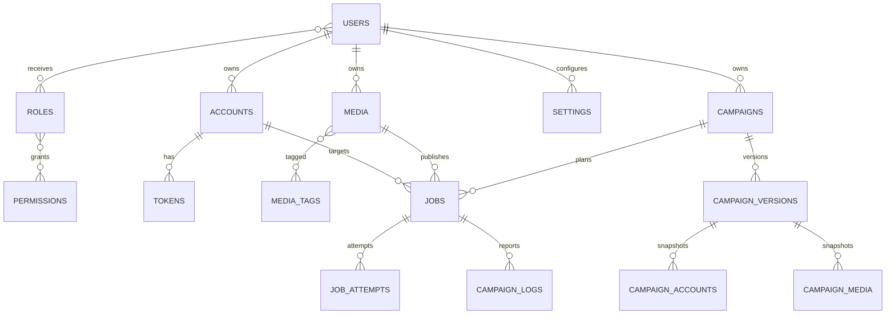

# Modelo de dados

Este é um modelo conceitual. Nomes, tipos, índices e migrations serão definidos somente após aprovação.

## 1. Convenções

Quase todas as tabelas de negócio devem possuir:

- `id` UUID;
- `owner_id` UUID quando multi-tenant;
- `created_at` e `updated_at` em UTC;
- versão para optimistic locking quando houver concorrência relevante;
- exclusão lógica somente onde exigida.

Tokens e segredos usam ciphertext versionado, nonce/IV e referência de chave; nunca texto aberto.

## 2. Entidades solicitadas e complementares

### Identidade e acesso

| Tabela | Responsabilidade |
|---|---|
| `users` | Perfil da identidade do Supabase, status de aprovação e timezone |
| `roles` | Papéis customizados |
| `permissions` | Capacidades atômicas |
| `user_roles` | Associação usuário-papel |
| `role_permissions` | Associação papel-permissão |
| `sessions` | Metadados e revogação de sessões da aplicação, se adotado |
| `refresh_tokens` | Apenas se o PostX emitir refresh tokens próprios; decisão pendente |
| `approvals` | Solicitação, decisão, administrador, motivo e timestamps |

### Instagram

| Tabela | Responsabilidade |
|---|---|
| `settings` | Configurações gerais e Instagram App por tenant; segredos cifrados |
| `accounts` | Conta profissional conectada e estado |
| `tokens` | Tokens cifrados, scopes, emissão, expiração, renovação e revogação |
| `oauth_states` | State/PKCE, expiração e consumo único do fluxo OAuth |
| `account_health_checks` | Histórico opcional de verificações da conexão |

### Mídia

| Tabela | Responsabilidade |
|---|---|
| `media` | Metadados, storage key, hash, estado e compatibilidade |
| `media_tags` | Tags pertencentes ao tenant |
| `media_tag_links` | Associação mídia-tag |
| `media_variants` | Thumbnail, capa ou arquivo normalizado derivado |
| `upload_sessions` | Uploads multipart/diretos e estado |

### Campanhas e execução

| Tabela | Responsabilidade |
|---|---|
| `campaigns` | Definição atual e estado da campanha |
| `campaign_versions` | Snapshot versionado usado no planejamento |
| `campaign_accounts` | Contas selecionadas, ordem e snapshot |
| `campaign_media` | Mídias selecionadas, ordem e snapshot |
| `jobs` | Unidade planejada de publicação |
| `job_attempts` | Cada tentativa do job |
| `campaign_logs` | Visão de negócio dos eventos de campanha/publicação |
| `scheduler` | Checkpoints, leases e execuções do planejador |
| `outbox_events` | Eventos transacionais pendentes de entrega |

### Operação

| Tabela | Responsabilidade |
|---|---|
| `notifications` | Central de notificações |
| `audit_logs` | Ações sensíveis append-only |
| `insight_snapshots` | Métricas por conta/mídia e momento |
| `plans` | Definição de plano |
| `user_plans` | Assinatura/limites do usuário |

## 3. Relações principais

## 4. Campos essenciais

### `accounts`

- `owner_id`
- `instagram_user_id`
- `display_name`
- `username`
- `profile_picture_url`
- `account_type`
- `status`
- `health_status`
- `health_confidence`
- `health_source`
- `health_checked_at`
- `health_last_success_at`
- `health_next_check_at`
- `health_consecutive_failures`
- `health_error_code`
- `health_error_subcode`
- `health_message`
- `health_action_required`
- `granted_scopes`
- `token_expires_at`
- `last_published_at`
- `published_count`
- `last_error_code`
- `connected_at`

Restrição única proposta: `(owner_id, instagram_user_id)` para contas não removidas.

`account_health_checks` mantém o histórico de transições e verificações manuais com detalhes sanitizados. O resumo corrente permanece em `accounts` para leitura rápida; índices parciais por próxima verificação e por proprietário/situação suportam o scheduler e a tela multi-tenant.

### `media`

- `owner_id`
- `original_name`
- `storage_bucket`
- `storage_key`
- `mime_type`
- `media_kind`
- `size_bytes`
- `duration_ms`
- `width`
- `height`
- `content_hash`
- `thumbnail_key`
- `status`
- `compatibility`
- `uploaded_at`

Índices propostos: `(owner_id, created_at)`, `(owner_id, media_kind, status)` e `(owner_id, content_hash)`.

### `cookie_story_presets`

- `owner_id` único;
- `media_id` referenciando mídia do mesmo tenant validada pela API;
- `link_url` HTTPS;
- `link_title` opcional, até 80 caracteres;
- timestamps.

O preset contém somente configuração de produto. Cookies, `csrftoken`, headers de requisição, URL assinada e resultado bruto do Instagram nunca entram nessa tabela. RLS limita linhas ao proprietário; o Data API não recebe privilégios diretos para a tabela e o backend gera URLs do original com TTL de cinco minutos.

### `campaigns`

- `owner_id`
- `name`
- `description`
- `caption`
- `hashtags`
- `publication_type`
- `media_strategy`
- `posts_per_hour`
- `duration_hours`
- `schedule_mode`
- `starts_at`
- `timezone`
- `cover_mode`
- `custom_cover_media_id`
- `state`
- `current_version`
- `progress counters`

### `jobs`

- `owner_id`
- `campaign_id`
- `campaign_version_id`
- `account_id`
- `media_id`
- `scheduled_at`
- `plan_position`
- `state`
- `priority`
- `idempotency_key`
- `attempt_count`
- `next_attempt_at`
- `lease_owner`
- `lease_expires_at`
- `external_container_id`
- `external_media_id`
- `published_at`
- `last_error_class`

Restrições: `idempotency_key` única; `plan_position >= 0` e única dentro de `campaign_version_id`; índices sobre `(state, scheduled_at)`, `(account_id, scheduled_at)` e `(campaign_id, state)`.

### `job_attempts`

- `job_id`
- `attempt_number`
- `started_at`
- `finished_at`
- `duration_ms`
- `request_operation`
- `response_status`
- `external_trace_id`
- `sanitized_response`
- `error_class`
- `retryable`

Não armazenar headers de autorização ou URLs assinadas completas.

## 5. RLS e autorização

- RLS é defesa adicional recomendada, não substitui tenant scope na aplicação.
- Frontend só deve acessar diretamente Storage/Auth e operações explicitamente desenhadas.
- Service role fica exclusivamente no backend/worker.
- Policies devem impedir leitura cruzada mesmo se um ID válido de outro tenant for conhecido.

## 6. Retenção proposta

| Dado | Proposta inicial |
|---|---|
| Audit logs | 12 meses ou requisito legal/comercial |
| Tentativas de publicação detalhadas | 90 dias |
| Logs operacionais de aplicação | 30 dias no agregador |
| OAuth state | minutos; remover após consumo/expiração |
| Notificações | 90 dias |
| Insights | agregados duráveis; snapshots brutos conforme custo |
| Mídia excluída | janela de recuperação definida, depois remoção física |

Prazos dependem de privacidade, custo e plano.

## 7. Observação sobre a lista original

As tabelas solicitadas foram preservadas. Tabelas associativas e operacionais adicionais são necessárias para normalização, idempotência, histórico e rastreabilidade. A tabela genérica `scheduler` não deve conter todo o plano; `jobs` é a fonte de verdade da execução.
# Proxies

`proxies` pertence ao usuário e armazena protocolo, host, porta, credencial cifrada, status, IP público, latência, cooldown, falhas consecutivas e `removed_at` para remoção lógica. `campaign_proxies` forma o pool da campanha; `campaign_proxy_assignments` materializa a proxy por `rotation_slot`. `jobs` e `job_attempts` registram a proxy usada em cada tentativa. Campanhas registram `proxy_mode` (`none`, `fixed`, `rotate_per_post`, `rotate_every_n_posts`) e `proxy_id`/pool quando aplicável. Campos históricos de rotação em contas permanecem apenas por compatibilidade interna e não são configuráveis na interface.
