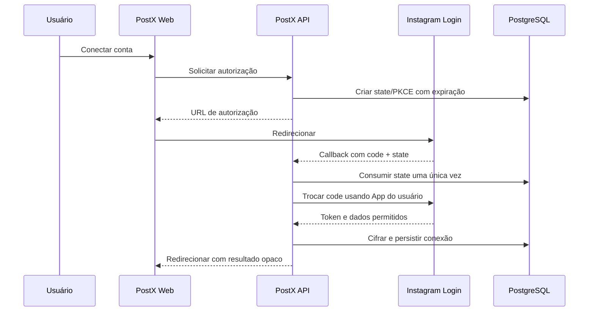

# Integração com Instagram

## 1. Regra da integração

O PostX usa a **Instagram Platform API com Instagram Login** para conectar a conta ao backend, obter tokens, executar campanhas e consultar dados. Não usa Facebook Login, senha do Instagram ou scraping no backend.

Por decisões explícitas do proprietário em 12 de agosto de 2026, a interface oferece uma extensão local opcional para restaurar no navegador uma sessão já autorizada por meio de export de cookies e, por clique, publicar um Story predefinido com link antes do convite. Essa operação isolada usa a sessão web e endpoints privados do Instagram porque a API oficial vigente publica Stories, mas não documenta parâmetro para o adesivo de link. A extensão somente aceita cookies de `instagram.com`, mantém fila/headers em armazenamento de sessão não sincronizado e não contorna desafios da Meta.

Essa exceção não substitui OAuth, não produz token de API e não autoriza campanhas, agendamento, insights, health checks ou publicação remota por cookie. Tudo isso permanece oficial.

## 2. Elegibilidade

Conforme a documentação oficial/coleção oficial consultada, o fluxo com Instagram Login destina-se a contas profissionais (Business e Creator) e não exige vincular uma Facebook Page. O produto deve:

- rejeitar ou orientar contas não elegíveis;
- detectar capacidades por tipo de conta;
- nunca prometer formatos/métricas sem verificar suporte atual.

Há indicação oficial de que Stories podem ter restrições adicionais por tipo de conta. Essa capacidade deve ser testada e validada no App/versão usada.

## 3. Scopes

Escopos mínimos atualmente indicados para o núcleo:

- `instagram_business_basic`;
- `instagram_business_content_publish`.

Escopos adicionais só serão solicitados quando uma função aprovada exigir. Os nomes antigos sem prefixo `instagram_` foram descontinuados em 27 de janeiro de 2025 segundo a coleção oficial da Meta.

Insights, comentários ou mensagens não devem ser presumidos a partir do escopo de publicação. O conjunto exato e o processo de App Review serão validados antes do desenvolvimento da função.

## 4. BYO Instagram App

Cada usuário fornece:

- Instagram App ID;
- Instagram App Secret;
- Redirect URI configurada;
- scopes aprovados/pretendidos.

Regras:

- OAuth usa sempre as credenciais do proprietário da conta/campanha.
- App Secret e tokens são cifrados com contexto do tenant.
- Callback resolve o tenant por `state` aleatório de uso único, nunca por parâmetro confiado do cliente.
- O Redirect URI precisa coincidir com o cadastrado no App do usuário.
- O usuário é responsável por configuração, modo Live e App Review; o PostX deve oferecer instruções e diagnóstico.

## 5. Fluxo OAuth proposto

Requisitos: state forte, PKCE quando suportado, HTTPS, timeout, callback idempotente e ausência de token em URL de retorno da UI.

### 5.1 Preparação opcional por cookie local

1. o operador instala a extensão local distribuída pelo Terbb Scale;
2. a tela `/app/contas/cookie` entrega o export diretamente à extensão, sem requisição de rede;
3. a extensão valida `sessionid` e `ds_user_id`, ignora cookies fora de `instagram.com` e restaura a sessão no Chrome;
4. o operador abre a área de convites e conclui as confirmações exigidas pela Meta;
5. a UI chama o mesmo `POST /accounts/connect` usado pelo fluxo normal;
6. o callback e o armazenamento do token seguem integralmente o fluxo OAuth oficial acima.

O arquivo original e seus valores nunca são persistidos no banco. Ao trocar de conta, somente os cookies do Instagram são removidos e substituídos.

## 6. Fluxo de publicação oficial

A publicação oficial normalmente é assíncrona em duas etapas:

1. disponibilizar mídia em URL acessível à Meta;
2. criar container;
3. para vídeo, consultar status até pronto ou erro;
4. publicar o container;
5. persistir o media ID externo;
6. reconciliar e coletar insights depois.

O worker deve tratar criação e publicação como operações distintas e persistir os IDs externos entre elas.

### 6.1 Story local com link durante a conexão

1. o tenant escolhe uma mídia `ready`, salva link HTTPS/título e edita posição, dimensões, rotação, fonte, itálico e cores do adesivo;
2. o backend persiste apenas o preset e valida tipo, tamanho, dimensões e duração;
3. após ativar a sessão, o Chrome captura localmente os headers web necessários;
4. ao clicar em “Postar Story”, a UI solicita uma URL assinada do original com TTL de cinco minutos;
5. a extensão confere o `ds_user_id`, baixa a mídia diretamente do Storage, enquadra imagem em 1080×1920 e renderiza localmente a edição; em vídeo, compõe um overlay com FFmpeg/WASM dentro do Chrome;
6. a extensão envia a mídia editada e configura a área clicável do adesivo pelo endpoint privado, mantendo cookies, CSRF, headers e bytes processados no navegador;
7. a fila recebe somente estado local sanitizado e então o operador segue para convite e OAuth.

Não há execução automática ao ativar sessão, retentativa cega, agendamento, processamento no backend ou persistência remota da resposta privada. O botão pode ser desativado por configuração de ambiente. Mudanças do Instagram podem quebrar esse fluxo sem aviso.

## 7. URLs de mídia

O bucket permanece privado. Para a Meta buscar o arquivo, o worker gera URL temporária:

- com validade maior que toda a janela de processamento/retentativa;
- sem registrar a URL completa;
- revogável por expiração;
- servida com MIME, tamanho e disponibilidade compatíveis.

Se URLs assinadas do Supabase não atenderem ao comportamento real da Meta, será criado um endpoint/proxy de entrega com token opaco e expiração. Essa decisão exige prova de integração.

## 8. Formatos

O PostX modela:

- Feed;
- Reel;
- Story.

Compatibilidade real depende de mídia, conta, versão e endpoint. Limites de codec, proporção, duração, tamanho, legenda, capa e número de itens devem ser carregados de uma matriz versionada e revalidados na documentação oficial.

Campanhas não terão fallback não oficial. A exceção é somente o Story local do item 6.1, durante a conexão por cookie e iniciado por clique.

## 9. Tokens

- Token armazenado cifrado e nunca exibido por completo.
- Expiração mantida como timestamp verificável.
- Renovação automática somente quando o tipo de token e a API suportarem.
- Renovar com antecedência configurável e lock por token.
- Falha de renovação muda a conta para `expiring`, `expired` ou `revoked` conforme diagnóstico.
- Reconexão exige novo consentimento quando necessário.
- Alterar App ID/Secret pode invalidar a capacidade de renovar tokens existentes; a UI deve alertar.

## 10. Limites e rate limiting

O sistema deve descobrir e respeitar:

- limite de conteúdo publicado por conta;
- limites do App/API;
- `Retry-After` e headers de uso quando disponíveis;
- capacidade específica por endpoint.

Valores numéricos não serão codificados como verdade permanente. A configuração terá defaults versionados, mas o worker consulta o limite oficial disponível e aplica o menor limite conhecido.

## 11. Erros

O adapter traduz respostas externas em classes internas:

- `auth_expired`;
- `permission_missing`;
- `rate_limited`;
- `media_invalid`;
- `container_processing`;
- `container_failed`;
- `account_ineligible`;
- `temporary_provider_error`;
- `unknown_provider_error`.

Resposta bruta pode conter dados sensíveis; somente uma versão sanitizada e limitada entra no banco/log.

### 11.1 Situação operacional da conta

O monitor consulta periodicamente o perfil autorizado pela API oficial e também aproveita erros tipados de publicação. Códigos de token inválido/expirado, checkpoint, usuário não confirmado, permissão, restrição, rate limit e falha temporária são convertidos em estados internos. A Meta não documenta, no fluxo Instagram Login, um campo universal `is_suspended`, `robot_check` nem um webhook de saúde da conta. Por isso:

- `operational` exige resposta oficial bem-sucedida;
- checkpoint/usuário não confirmado pode gerar `action_required` confirmado pelo erro;
- uma suspensão genérica não pode ser confirmada pela API e aparece somente como `possibly_suspended`, com confiança `inferred`;
- rate limit, timeout e falha 5xx resultam em `provider_unavailable`, sem acusar a conta;
- nenhum scraping, login por senha, cookie ou automação de navegador será usado para preencher essa lacuna.

## 12. Insights

Views, likes, comentários, compartilhamentos, salvamentos, alcance e outras métricas variam por tipo de mídia e versão. O coletor deve:

- solicitar `instagram_business_manage_insights` no Instagram Login, além de `instagram_business_basic`;
- solicitar somente métricas suportadas;
- armazenar valor, período, origem, timestamp e versão;
- tratar indisponibilidade como `null`;
- atualizar snapshots em janelas decrescentes;
- não comparar métricas semanticamente diferentes como se fossem iguais.

## 13. Webhooks

Webhooks não são necessários para a primeira publicação, mas podem reduzir polling em funções suportadas. Qualquer webhook futuro exige:

- verificação de assinatura;
- idempotência;
- resposta rápida;
- processamento assíncrono;
- isolamento por App/tenant;
- proteção contra replay.

## 14. Checklist antes da implementação

- [ ] Confirmar versão suportada da Graph API e data de expiração.
- [x] Confirmar scopes exatos para publicação e insights (`instagram_business_content_publish` e `instagram_business_manage_insights`).
- [ ] Confirmar formatos por Business/Creator.
- [ ] Confirmar especificações atuais de mídia.
- [ ] Confirmar ciclo e renovação dos tokens.
- [ ] Confirmar limites de publicação e rate limit.
- [ ] Confirmar suporte e parâmetros de capa.
- [x] Confirmar métricas por tipo de mídia na referência da Graph API v25.0.
- [ ] Executar App Review/testes apenas após autorização.
