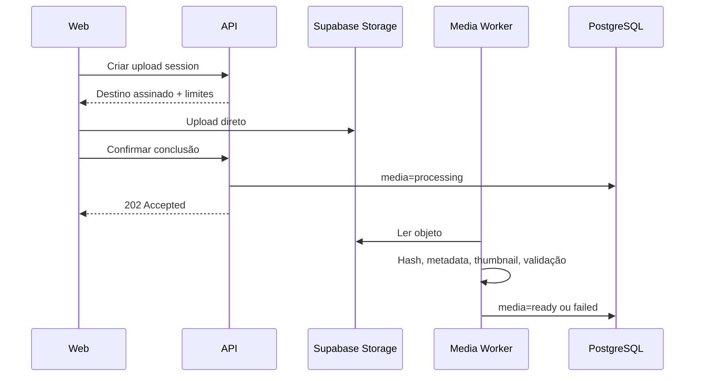

# Biblioteca de mídia e storage

## 1. Fluxo de upload



Upload direto evita transferir arquivos grandes pelo processo FastAPI.

## 2. Validação em camadas

1. **Cliente:** extensão, tamanho conhecido e feedback rápido.
2. **Sessão de upload:** allowlist de MIME/tamanho.
3. **Storage callback/confirmação:** existência, tamanho e ownership.
4. **Worker:** assinatura real do arquivo, codec, dimensões, duração e integridade.
5. **Campanha:** compatibilidade com formato e conta no momento da ativação.
6. **Publicação:** revalidação mínima contra regras atuais.

Extensão e `Content-Type` enviados pelo navegador não são confiáveis.

## 3. Metadados

Cada mídia mantém:

- nome original e nome exibido;
- imagem/vídeo;
- MIME detectado;
- duração;
- tamanho em bytes;
- largura e altura;
- thumbnail;
- hash criptográfico de conteúdo;
- data do upload;
- status;
- tags;
- compatibilidade e motivos de incompatibilidade.

Campos técnicos adicionais podem incluir codec, frame rate, bitrate e orientação.

## 4. Caminhos no storage

Padrão conceitual:

```text
tenants/{owner_id}/media/{media_id}/original
tenants/{owner_id}/media/{media_id}/thumbnail.webp
tenants/{owner_id}/media/{media_id}/variants/{variant_id}
tenants/{owner_id}/covers/{cover_id}
```

O nome original não faz parte do path de segurança. Buckets são privados.

## 5. Hash e duplicidade

- Hash calculado no worker a partir do conteúdo.
- Unicidade é por tenant, não global.
- Política proposta: avisar e permitir reutilizar o registro existente, sem excluir automaticamente.
- Nunca revelar que outro tenant possui arquivo com o mesmo hash.

## 6. Tags e pesquisa

- Tags normalizadas por tenant.
- Pesquisa por nome, tag e, futuramente, metadados.
- Filtros combináveis por tipo, status, compatibilidade e intervalo de data.
- Listagem por cursor e carregamento virtual para grandes bibliotecas.

## 7. Preview

- Thumbnails otimizadas para grid.
- Vídeo carregado sob demanda.
- URLs assinadas curtas e renovadas quando necessário.
- Nenhum token/URL assinada vai para log de analytics.

## 8. Capas

Capas são variantes de mídia ou assets próprios, sempre vinculadas ao tenant. O preview deve respeitar crop/aspect ratio efetivo. Capas incompatíveis permanecem na biblioteca, mas não são selecionáveis para aquele formato.

## 9. Processamento

Operações pesadas são assíncronas:

- probing de mídia;
- hash;
- thumbnail;
- normalização opcional;
- verificação de segurança.

Ferramentas concretas, como FFmpeg, serão aprovadas na implementação. Falha de processamento não apaga o original automaticamente.

## 10. Exclusão e retenção

- Arquivar remove da seleção padrão.
- Excluir verifica referências em campanhas/jobs.
- Objeto em job futuro não pode ser removido sem cancelar/substituir o job.
- Remoção física ocorre por tarefa idempotente após janela de recuperação.
- Variantes órfãs são limpas por reconciliação.

## 11. Quotas

Quotas por plano podem limitar:

- bytes totais;
- número de arquivos;
- tamanho por arquivo;
- uploads concorrentes;
- processamento diário.

Valores dependem da definição dos planos.

