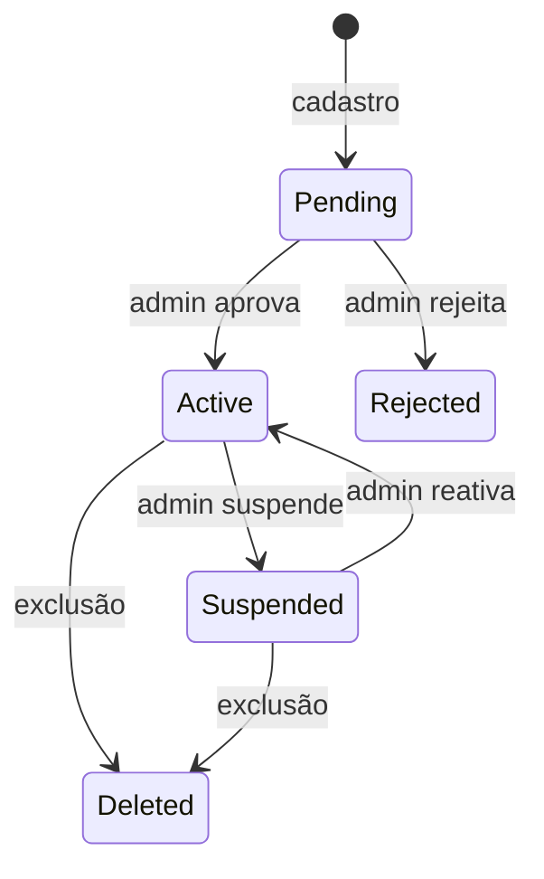

# Autenticação, autorização e administração

## 1. Separação de responsabilidades

- **Supabase Auth:** identidade, senha, recuperação e emissão de sessão.
- **PostX:** aprovação, status, papéis, permissões, tenant e regras de acesso.

O backend nunca confia apenas em claims antigas para `status` e permissões críticas; usa cache curto e fonte de verdade revogável.

## 2. Cadastro e aprovação



“Não consegue entrar” será implementado como: o usuário pode concluir a autenticação de identidade, mas não recebe acesso à aplicação e às APIs enquanto `pending`. Se um hook oficial do Supabase permitir bloquear a emissão de sessão com segurança, ele pode complementar esse controle; a API continuará validando o status.

## 3. JWT e refresh token

Há duas alternativas:

### A. Sessão Supabase como sessão do PostX — recomendada

- Supabase emite access JWT e refresh token.
- Backend valida assinatura, issuer, audience, expiração e usuário.
- PostX mantém status/revogação própria.
- Evita dois pares de tokens e reduz superfície.

### B. Token exchange

- Frontend autentica no Supabase.
- Backend troca a identidade por tokens próprios do PostX.
- Exige signing keys, rotação, tabela de refresh token com hash, detecção de reuse e revogação.

A escolha deve ser aprovada. A tabela `refresh_tokens` só será usada na opção B.

## 4. Armazenamento no navegador

Proposta:

- access token de curta duração em memória;
- refresh token em cookie `HttpOnly`, `Secure`, `SameSite` compatível, se o fluxo escolhido permitir;
- nunca em `localStorage` se houver alternativa segura;
- CSRF token para endpoints autenticados por cookie;
- CSP e proteção XSS.

## 5. RBAC

Papéis iniciais:

| Papel | Finalidade |
|---|---|
| `user` | Gerenciar somente seus recursos |
| `support` | Diagnóstico limitado, sem segredos |
| `admin` | Aprovação, usuários, planos e operação |
| `super_admin` | Ações excepcionais e gestão de admins |

Permissões atômicas propostas:

```text
account:read account:write
media:read media:write
campaign:read campaign:write campaign:execute
logs:read
settings:read settings:write
admin:users admin:approvals admin:plans admin:logs admin:health
```

Toda ação exige também ownership, salvo permissão administrativa explicitamente desenhada.

## 6. Ações administrativas

- Aprovar: registra admin, data e observação opcional.
- Rejeitar: exige motivo interno; comunicação ao usuário é política pendente.
- Suspender: exige motivo, revoga sessões e impede novos jobs; política sobre jobs em andamento é configurável.
- Excluir: exige confirmação forte, auditoria e workflow assíncrono.
- Editar: campos sensíveis têm trilha before/after sanitizada.

## 7. Planos

A tela existe no escopo, mas planos e cobrança ainda não estão definidos. O modelo deve suportar limites sem conectar um provedor de pagamentos no MVP:

- contas conectadas;
- armazenamento;
- campanhas ativas;
- posts por período;
- usuários de equipe futuros;
- retenção de logs.

## 8. Proteção da área admin

- Rotas e layout separados.
- Autorização server-side.
- MFA obrigatório para admin é recomendação bloqueadora para produção.
- Sessão administrativa mais curta.
- Reautenticação para exclusão, alteração de papel e visualização operacional sensível.
- Sem impersonation no MVP; se criada, precisa banner, prazo, escopo e auditoria.

